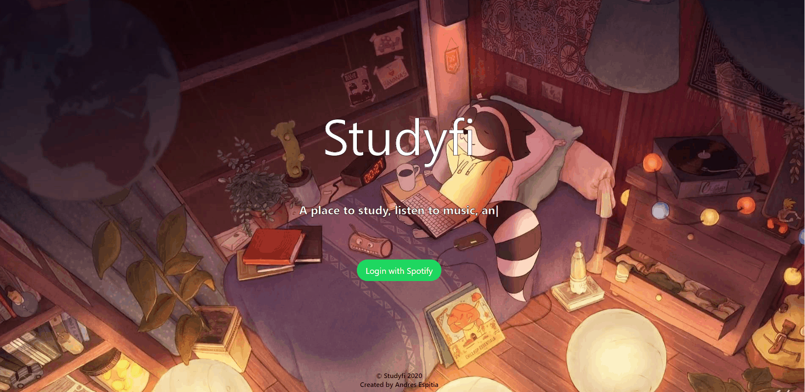
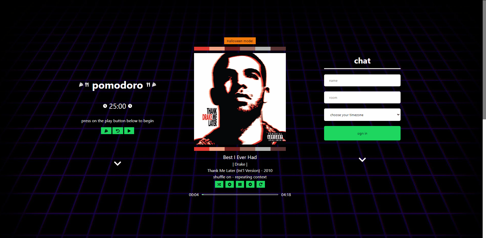

# Studyfi

:musical_note: A place to study, listen to music, and chat with friends. Getting work done while listening to music on one page.
  
:musical_keyboard: Once logged in with your Spotify account, you can view which song you are currently listening to, use a Pomodoro timer, chat with friends, and see your most listened to song and artists.

Created by Andres Espitia
- https://github.com/espitiaandres

Front End Source code:
- https://github.com/espitiaandres/studyfi

Back End Source code:
- https://github.com/espitiaandres/studyfi-backend

Live on: https://www.andres-espitia.com/studyfi

### TODO:

- improve README.md

## Summary

I decided to make a full stack web app using node.js and react.js to help me when studying. I've noticed that most apps that I use when studying are on different platforms (ex: Spotify on my phone/computer, Messenger on my computer, my phone's stopwatch), and that constant switching between platforms and devices would distract me. I decided to make my own web app which would contain all these services in one place, and also to learn more about react.js and node.js.

### Stack
- **Front End**
  - React.js
 - **Back End**: 
    - Node.js
    - Express
 

If currently not playing music on Spotify, the following will occur after signing in:

If currently playing music on Spotify, the following Dashboard page will appear.

How to work the Pomodoro timer. Also, check out the seasonal mode by clicking on the "______ mode" button at the top of the screen.

How to work the Spotify player:

Don't forget to scroll down or click on the bouncing chevron icon to view your most played artists and songs!

## Inspiration

For CWF Fall 2020, I decided to make an app that could help me when I study when on a study term in University. I've noticed that when I'm studying or working on assignments, I usually need 3 things:

- Spotify (or YouTube, any music playing software)

- Facebook Messenger

- and a Stopwatch (to help me keep track of time)

I didn't find any existing apps that had that I liked, and I also wanted to learn more about full stack web development.

I was also curious what were most played songs and who were my most played artists at different time periods. Interacting with the Spotify API allowed me to do this, and I also learned about what song statistics Spotify tracks.

<!-- 
- add chat functionality (added on September 5, 2020)

- removed cors policy error ('http://localhost:3000' has been blocked by CORS policy: No 'Access-Control-Allow-Origin' header is present on the requested resource), and the 503 websocket connection error.

- add user disconnect functionality with proper routing
-->
  

## Challenges

The biggest challenge for me was piecing and wiring all of the different things I would need when studying. I had some experience in React.js but since this is a full-stack application, I tried to keep scalability and code reusability at the forefront. 

Other challenges I faced were roadblocks on the backend, as I was rusty on Node.js and Express. One of these challenges was bypassing the CORS policy error and the different websocket connection errors that would arise from the chat portion of the app.
 

## Reflections

During this time, I feel that I learned more about full-stack development, and was able to learn more about React.js, Node.js, and Express. Experimenting with different npm modules was also very interesting as well, which for me shed more light on the importance open source code.

I don't think I'm done with this project. I'd like to extend this to be more interactive in the way that the user receives their listening statistics from Spotify. Personally, I find the Spotify Wrapped event every year very interesting because it's a playback of the different songs I listened to, which also helps me remember memories that I made throughout the year(s). If I could replicate this same event in an app that can be accessed year-round, that would be a nice addition.

I'd also like to maybe venture into React native, or try to make this application more mobile friendly. I've always found mobile development interesting, so maybe I'll extend this project there.

Stack Overflow, Google, and YouTube were the most helpful resources when developing this app. (So many hours of debugging were avoided by consulting these resources).
